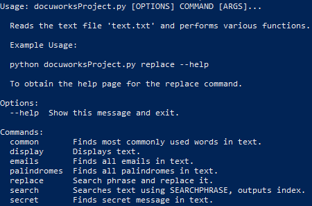

# DocuWorks Text Editor Assessment
> Reads a text file (text.txt) and performs various functions on it as required by the Product Owner.

[](https://github.com/psf/black)

Text editor that performs various functions as follows:
* Display text.
* Search text for a user-input phrase.
* Search for a user-input phrase and replace it.
    * Following this, allow the user to save text as a new file.
* List the most common words seen in the text.
* Find and list all palindromes.
* List all email addresses found in the text.
* Show the secret message in the text.
    * Secret message is encoded as mid-word upper case characters.
    * Secret message uses Caesar Cipher with shift 13.



## Installation
Create and activate a virtual environment (venv):
```sh
python -m venv venv
```

**OS X and Linux**
```sh
./venv/bin/activate
```
```sh
pip3 install -r requirements.txt
```

**Windows**
```sh
.\venv\Scripts\activate.bat
```
```sh
python -m pip install -r requirements.txt
```

## Documentation
**Table of Contents**

1. Structure
2. Menu
3. MyTextProcessor Examples

**Structure:**

The program is divided into three sections:


### Custom Exceptions:
```
class NoPalindromesError(Exception):
```
```
class NoEmailAddressesError(Exception):
```
These exceptions are raised in the ```MyTextProcessor``` class under ```findPalindromes``` and ```findEmails``` respectively, when the text is processed and contains no palindromes or email addresses.

As an example, both palindromes and emails are checked as an empty list:
```
if (
    palindromes == []
):
    raise NoPalindromesError
```
This raises the ```__str__``` component of ```NoPalindromesError(Exception)``` class: 
```
def __str__(self):
    return f"The processed string contains no palindromes."
```

### MyTextProcessor Class:
```
class MyTextProcessor(TextProcessor):
```
Calls ```TextProcessor(ABC)``` abstract class.

```TextProcessor``` contains all the primary features of the program, seen as functions. It is made up of the following functions:

---
```
def load(self, path):
```
Opens the text file under Path ```text.txt``` under read ```"r"``` as a file, and stores it in ```self.text```. This variable is used in the rest of the ```MyTextProcessor``` functions as a string file to perform actions on:
```
with click.open_file(path, "r") as file:
    self.text = file.read()
```

---
```
def display(self):
```
Simply prints the ```self.text``` string:
```
click.echo(self.text)
```
---
```
def iterSearch(self, searchPhrase):
```
Uses ```import re``` function ```finditer``` to iteratively search through the ```self.text``` string using ```searchPhrase``` and stores it in ```result```:
```        
result = re.finditer(
    searchPhrase, self.text
    )
```
```re.finditer``` outputs an iterator datastream, from which the index numbers have to be printed. 

Indices are acquired by 
```
indices = [
    index.start() for index in result
```
after which the indices are printed.

---
```
def replace(self, searchStr, replaceStr):
```
Makes use of ```import re``` function ```sub``` to substitute (replace) ```self.text``` substrings ```searchStr``` with ```replaceStr``` and then prints the new text:

```
newTxt = re.sub(searchStr, replaceStr, self.text)
```
---
```
def save(self, path):
```
Can be called to open a file as 'write' ```"w"``` following ```path``` input:
```
with click.open_file(path, "w") as newFile:
    newFile.seek(0)  # Start at beginning of the file.
    newFile.write(self.newTxt)
```
It makes sure to write at the beginning of the file, regardless of if it is a new file or not with ```.seek(0)```

---
```
def findCommon(self, limit):
```
Is used to find the most common words in the text, ranked by ```limit``` set by the user input.
```
words = self.text.split(" ")
```
Splits the entire text string into a list, where each word is a list item. This makes it easier to count the number of common words.
```
words_count = Counter(words).most_common()
```
```Counter()``` is used from the ```collections``` [module](https://docs.python.org/3/library/collections.html#collections.Counter) to create a [dictionary](https://docs.python.org/3/glossary.html#term-dictionary) ```words_count``` with their *key* as popularity, *value* as number of occurrences. These are then printed:
```
for x in range(limit):
    click.echo(
        f"Most frequent word place {x + 1} is: {words_count[x][0]} with {words_count[x][1]} occurrences."
    )
```

---
```
def findPalindromes(self) -> list:
```
This function makes extensive use of substrings and string slicing to compare every substring of ```this.text``` to its inverted counterpart.
> To clarify, This function finds any palindromes in the extreme sense, as any word, phrase or letters of which can give the same result when reversed.
If the client only wants palindromes as words (which wasn't specified), instead each word in text could be added to a list using string slicing,
then loop through the list, comparing each entry to its inverted counterpart.

Firstly the text is converted to lower case and has its spaces and its newlines ```"\n"``` removed as they will interfere with processing palindromes:
```
string = self.text.lower().replace(" ", "").replace("\n", "")
```
By which
```
stringLength = len(string)
```
makes sure we know how many times to loop through the entirety of the text. We also make sure to store the palindromes found in a list aptly named ```palindromes```

We will use the ```click``` module to provide a ```progressbar``` as this loop might take a while to complete, depending on the length of the text given:
```
with click.progressbar(
    length=stringLength
    ) as bar:
```
Now we use the ```stringLength``` variable to loop through the entire text, slicing each segment and comparing it to its inverse. The inverse of the substring is ```[::-1]```. Since we are doing temporary comparisons and storing the palindrome in a list, we use a ```temp``` variable to store strings:
```
for i in bar:
    for j in range(i + 1, stringLength + 1):
        temp = string[
            i:j
        ]
        if len(temp) > 2:
            if (
                temp == temp[::-1]
            ):
```
> ```i in bar``` is used instead of ```i in stringLength``` because we are using ```click``` to create a ```progressbar```

Finally we check if any palindromes were found, raise a ```NoPalindromesError``` if not, else ```return``` them to be printed:
```
if (
    palindromes == []
):
    raise NoPalindromesError 
else:
    return palindromes
```

---
```
def findEmails(self):
```
Regular expressions are a powerful tool to find specific substrings in the text. In this case we want to find email substrings. 

There are a few characters that set emails apart from the rest, mainly the '@' symbol. We can use ```re.findall``` to find all substrings specified by the regular expression and add them to the list ```emails```:
```
emails = re.findall(
     r"[a-z0-9\-+_]+[\.(?!\.)]*[a-z0-9\-+_]+@[a-z0-9\-+_]+[\.(?=\.)]*[a-z]+[a-z\.]*",
     self.text,
)
```
Since we want to avoid invalid email addresses, we use the regex [lookahead](https://docs.python.org/3/howto/regex.html#lookahead-assertions) functionality:
```
[\.(?!\.)]*
```
Specifies a *negative* lookahead ```?!``` for the period ```\.``` following another period. This avoids email addresses that have multiple periods following each other directly, which is invalid.

Just like with the previous function, if no emails are found we raise an exception:
```
if emails == []:
    raise NoEmailAddressesError
else:
    click.echo(emails)
```

---
```
def findSecret(self):
```
Uses [unicode](https://docs.python.org/3/howto/unicode.html) functionality to solve a [Caesar Cipher](https://en.wikipedia.org/wiki/Caesar_cipher) found hidden within the text as a secret.

Since the text file ```text.txt``` contains several words with upper-case characters randomly spread within, we can use ```re.findall``` to store a list of all of these words:
```
capitalwords = re.findall(r"[a-z]+[A-Z]+[a-z]+", self.text)
```
> This regular expression simply finds one or more ```[A-Z]``` between lower case characters ```[a-z]``` and stores them in list ```capitalwords```

Now we need to extract the upper-case *characters* from these words. This is done through list comprehension, where each string ```word``` in ```capitalwords``` is looped through, seeing which character ```char``` is upper case. Each upper case character is put into list ```upper```:
```
upper = []
for word in capitalwords:
    string = ""
    string = [
        char for char in word if char.isupper()
    ].pop()
    upper.append(string)
```
> We need to use ```.pop()``` as we are using list comprehension to loop through the characters in ```word```, otherwise ```upper``` would have nested lists within itself.

The shift for the Caesar Cipher in this particular text is 13, so we define that before using ```.join()``` on ```upper``` to turn our list into a single string of upper-case characters:
```
shift = 13
encryptedString = ""
encryptedString = encryptedString.join(upper)
```
Finally we use unicode's internal functions in Python ```ord``` and ```chr``` to first convert each ```char``` in ```encryptedString``` into its respective unicode, find its index position, and shift it by 13. Then we convert it back to a character and add it to ```decryptedString```:
```
for char in encryptedString:
    uni = ord(char)

    index = uni - ord("A")

    new_index = (index - shift) % 26

    new_uni = new_index + ord("A")

    new_char = chr(new_uni)

    decryptedString += new_char
```
> The modulus for 26 is used as there are 26 characters in the alphabet, so the character will loop back from 26 to 0 if shifted beyond.

```decryptedString``` is then printed.

---