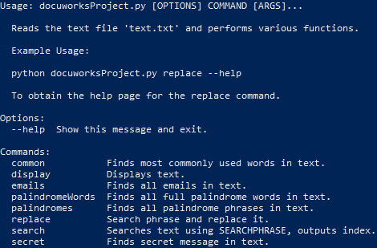

# DocuWorks Text Editor Assessment
> Reads a text file (text.txt) and performs various functions on it as required by the Product Owner.

[](https://github.com/psf/black)

Text editor that performs various functions as follows:
* Display text.
* Search text for a user-input phrase.
* Search for a user-input phrase and replace it.
    * Following this, allow the user to save text as a new file.
* List the most common words seen in the text.
* Find and list all palindromes.
* List all email addresses found in the text.
* Show the secret message in the text.
    * Secret message is encoded as mid-word upper case characters.
    * Secret message uses Caesar Cipher with shift 13.



## Installation
OS X and Linux:
```sh
$ source <venv>/bin/activate
$ source pip3 install -r requirements.txt
```

Windows:
```sh
C:\> <venv>\Scripts\activate.bat
C:\> python -m pip install -r requirements.txt
```

## Documentation

## Release History